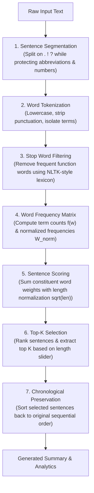

# SmartSummarizer – Text Summarization

<div align="center">


-f59e0b?style=for-the-badge)

<br/>

**A modern, client-side Extractive Text Summarization web application developed for the College Text & Speech Analysis (TSA) laboratory curriculum.**

</div>

---

## 📌 Experiment Identification

- **Course:** Text & Speech Analysis (TSA)
- **Laboratory Experiment:** **Experiment 04 — Text Summarization**
- **Website Title:** **SmartSummarizer – Text Summarization**
- **Architecture:** Client-Side Extractive Natural Language Processing (NLP)
- **Tech Stack:** HTML5, Vanilla CSS3, JavaScript (ES6+)
- **External Dependencies / API Keys:** **None** (No backend, 100% offline-capable, zero third-party AI keys)

---

## 📖 Theoretical Background

### What is Text Summarization?
> *“Text summarization automatically reduces a long document into a shorter version while preserving its important information.”*

In computational linguistics and NLP, text summarization is divided into two primary paradigms:

| Feature | Extractive Summarization (Used in this Project) | Abstractive Summarization |
| :--- | :--- | :--- |
| **Methodology** | Identifies, scores, and extracts key original sentences directly from the passage. | Generates novel sentences through paraphrasing and generative language models. |
| **Factual Accuracy** | **100% Faithful** to source material (zero hallucination). | Risk of factual inaccuracies, distortion, or hallucinations. |
| **Computational Footprint** | Extremely lightweight; runs instantaneously in the browser. | Heavyweight; requires multi-gigabyte models or remote cloud APIs. |
| **Sentence Order** | Preserves original chronological sentence order for natural narrative flow. | Reorders concepts based on generative decoding. |
| **Privacy & Security** | Data never leaves the client's local machine. | Text is often transmitted across third-party remote API endpoints. |

---

## 🔬 The 7-Step Extractive Summarization Algorithm

The core engine implements an end-to-end statistical extractive pipeline directly in JavaScript:



### Mathematical Formulation

1. **Normalized Word Frequency:**
   For every non-stop word $w$ in the document:
   $$W_{\text{norm}}(w) = \frac{f(w)}{f_{\max}}$$
   Where $f(w)$ is the raw count of word $w$, and $f_{\max}$ is the frequency of the most common content word.

2. **Sentence Significance Score:**
   Each sentence $S_i$ is evaluated by summing the normalized weights of its constituent content words, scaled by a square-root length normalization factor to eliminate bias toward disproportionately long run-on sentences:
   $$\text{Score}(S_i) = \frac{\sum_{w \in S_i \setminus \text{StopWords}} W_{\text{norm}}(w)}{\sqrt{\text{WordCount}(S_i)}}$$

3. **Top-$K$ Extraction:**
   Sentences are ranked by $\text{Score}(S_i)$ in descending order. The top $K$ sentences are selected based on the user's desired summary length:
   - **Short (1):** $K \approx \lceil 0.30 \times N \rceil$ (minimum 1 sentence)
   - **Medium (2):** $K \approx \lceil 0.50 \times N \rceil$ (balanced, default)
   - **Long (3):** $K \approx \lceil 0.70 \times N \rceil$ (maximum context)

4. **Chronological Sequence Restoration:**
   The selected set $\{S_k\}$ is re-sorted by their initial appearance index:
   $$\text{Summary} = \bigcup_{i \in \text{SortedIndices}} S_i$$

5. **Compression Ratio:**
   $$\text{Compression \%} = \left(1 - \frac{\text{Summary Word Count}}{\text{Original Word Count}}\right) \times 100$$

---

## ✨ Features & Interface

- **Modern Glassmorphic UI:** Deep midnight slate background with glowing violet and cyan gradient accents, custom scrollbars, and accessible typography.
- **Large Interactive Textarea:** Placeholder: *"Enter an article or paragraph..."* with live character, word, and sentence counters.
- **Summary Length Slider:** Three calibrated states (**Short**, **Medium**, and **Long**) with live re-summarization.
- **Action Buttons:**
  - 📖 **Load Example:** Automatically populates an academic paragraph discussing *Artificial Intelligence in Healthcare*.
  - ⚡ **Summarize Now:** Runs the 7-step extraction pipeline and renders analytics smoothly.
  - 🧹 **Clear:** Wipes the input text, metrics, and resets the interface.
  - 📋 **Copy:** One-click clipboard copy with animated visual feedback (`Copied!`).
- **Real-Time Analytics Grid:**
  - 🟣 **Original Words & Sentences**
  - 🔵 **Summary Words & Sentences**
  - 🟢 **Sentences Retained Ratio** (e.g., $4 / 7$ sentences, $57\%$ retained)
  - 🟠 **Compression Percentage** with animated progress bar fill
- **Interactive Multi-Tab Lab Diagnostic System:**
  1. **Summary & Original View:** Side-by-side comparison featuring an interactive green highlight overlay on extracted sentences within the original text.
  2. **Sentence Scoring Inspector Table:** Inspect each sentence's original index, full preview, word count, raw score, normalized score, global rank (`#1`, `#2`, etc.), and selection status (`✔ Included` vs `✘ Omitted`).
  3. **Word Frequency Matrix:** Visual tag cloud of the top keywords driving the sentence scoring engine.
  4. **Laboratory Theory Section:** Complete educational background for viva voce and project presentations.

---

## 🧪 Sample Demonstration (AI in Healthcare)

### Input Document:
> *"Artificial intelligence is rapidly transforming modern healthcare by accelerating diagnostic precision, optimizing treatment pathways, and personalizing patient clinical care. Advanced machine learning models analyze complex medical imaging such as MRI scans, computed tomography, and digital pathology with accuracy that rivals seasoned radiologists. In clinical oncology, predictive neural networks detect malignant cellular mutations months before visible symptomatic onset, empowering physicians to administer proactive therapeutic interventions. Natural language processing algorithms sift through millions of unstructured electronic health records, reducing clinical documentation burdens and allowing medical personnel to devote greater focus to direct patient bedside care. Predictive epidemiological models forecast patient admission spikes, enabling hospital administrators to proactively allocate critical intensive care unit beds and medical resources. Despite these profound breakthroughs, deploying healthcare AI necessitates rigorous ethical governance, algorithmic transparency, and stringent demographic validation to prevent algorithmic bias. Ultimately, artificial intelligence is engineered not to displace human medical practitioners, but to elevate their diagnostic acumen and enrich the delivery of compassionate, evidence-based medicine."*

### Quantitative Output Metrics:

| Metric | Short Setting | Medium Setting (Default) | Long Setting |
| :--- | :---: | :---: | :---: |
| **Original Words** | 160 | 160 | 160 |
| **Summary Words** | 69 | 91 | 114 |
| **Sentences Retained** | 3 of 7 (43%) | 4 of 7 (57%) | 5 of 7 (71%) |
| **Compression Ratio** | **56.9%** | **43.1%** | **28.7%** |
| **Selected Sentences** | #1, #4, #5 | #1, #3, #4, #5 | #1, #2, #3, #4, #5 |

---

## 📁 Repository Structure

```
TSA4/
├── .gitignore          # Strictly excludes .env, node_modules, logs, and OS caches
├── index.html          # Semantic HTML5 layout, accessible controls, and lab headers
├── style.css           # Glassmorphic midnight-slate theme, custom range slider, responsive grid
├── script.js           # Pure client-side extractive summarization engine & DOM controller
└── README.md           # Comprehensive lab experiment documentation & theory
```

---

## 🚀 How to Run Locally

This application requires **no installation, no Node packages, and no web server**.

### Method 1: Direct Browser Launch (Simplest)
1. Clone or download this repository:
   ```bash
   git clone https://github.com/kameshpa7-hash/TSA4.git
   cd TSA4
   ```
2. Double-click `index.html` to open it directly in any modern browser (Chrome, Edge, Firefox, Brave, Safari).

### Method 2: Local Static Server
If you prefer serving via HTTP:
```bash
# Using Node's npx serve
npx serve .

# Or using Python
python -m http.server 8000
```
Open `http://localhost:8000` or `http://localhost:3000` in your web browser.

---

## 🛡️ Privacy & Environment Safety
- **No `.env` files** are used or included in this repository.
- Complete execution takes place strictly on the client's browser using native JavaScript APIs.
- Zero network telemetry, tracking, or cloud API transmission.

---

## 📜 License
This project is open-source and developed for the **Text & Speech Analysis (TSA)** laboratory curriculum.
